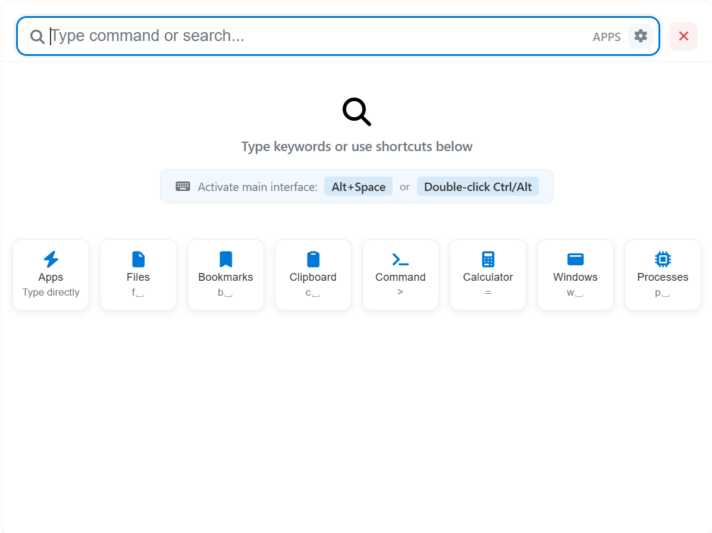
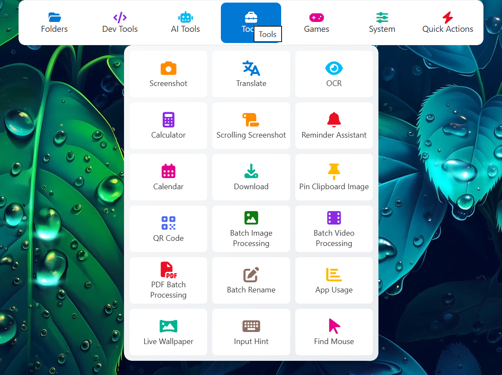

  

<h1 align="center">yyzTools</h1>

  <strong>Yes Your Zen Tools</strong>

<a href="README.md">English</a> · <a href="README.zh-CN.md">简体中文</a> · <a href="README.zh-TW.md">繁體中文</a> · <strong>日本語</strong> · <a href="README.ko.md">한국어</a> · <a href="README.fr.md">Français</a> · <a href="README.de.md">Deutsch</a> · <a href="README.es.md">Español</a> · <a href="README.ru.md">Русский</a> · <a href="README.ar.md">العربية</a> · <a href="README.pt.md">Português</a> · <a href="README.it.md">Italiano</a>

  
  
  
  

---
## スクリーンショット

  
  

---

## 概要

検索、翻訳、認識、プレビュー、一括処理、スクリーンショット、壁紙——日常的に頻繁に発生する細かな作業のために、拡張機能ストアで一つずつ探し、インストールし、課金する必要はもうありません。yyzTools を一度入れておけば、必要なものはいつでもすぐ手元にあります。

## 特長

- **永久無料** — 全機能を開放しています。有料アンロックや会員制度はなく、中核機能を制限して実質的に課金することもありません。
- **ローカル優先** — クリップボード、ファイル検索、使用統計、OCR などのデータは、すべてお使いのパソコン内で処理・保存され、自動的にアップロードされることはありません。
- **一度のインストールで完結** — 40 以上の機能モジュールがすぐに使えます。一つずつ探して、比べて、ダウンロードして、試して、削除するという手間が要りません。
- **379 個のコマンドモジュール** — AI、アプリ、ゲーム、システム、Web サイトの 5 分類のコマンドをすぐに利用できます。JSON ファイルを 1 つ追加するだけで自分で拡張できます。

## 機能一覧

| | |
|---|---|
| **コマンドパレット** | アプリ検索 · ファイル検索 · プロセス管理 · ウィンドウ管理 · ブックマーク検索 · クリップボード履歴 · コマンドライン · 即時計算 |
| **ランチャーと効率化** | ドック · クリップボード履歴 · アプリ使用統計 · スクリーンショット · 画面収録 · リマインダー · 万年暦 · キー入力表示 · マウス位置表示 |
| **テキストと言語** | スーパー翻訳 · 文字認識 OCR · 正規表現 · エンコード・デコード · ハッシュ計算 · 暗号化・復号 · データ変換 · データ生成 |
| **ファイルとメディア** | ファイルプレビュー · 一括リネーム · 画像の一括処理 · 動画の一括処理 · PDF の一括処理 · ファイルダウンロード |
| **計算と拡張** | 計算用紙 · QR コード · コマンドモジュール · 内蔵ブラウザー · カスタム拡張 |
| **パーソナライズ** | ライブ壁紙 · デスクトップエフェクト · ゲームモード · ナビゲーションページ · 地球防衛戦 |

## アーキテクチャ

ハイブリッド構成：**C++（Win32 + WebView2）ホスト**が **フロントエンド（Alpine.js + ネイティブ JS + Vite）** を搭载し、機能ごとにプロセスを分離しています。

| プロセス | 職責 |
|---------|------|
| `yyzTools.exe` | メインプロセス。コマンドパレット / 翻訳 / OCR など大多数の機能を搭载 |
| `yyzWallpaper.exe` | ライブ壁紙。Windows Composition API でデスクトップアイコン層の下に合成表示 |
| `yyzBrowser.exe` | コマンドモジュールが URL を開くための内蔵フレームレスブラウザー |
| `yyzCmd.exe` | 純 Win32 製コマンド実行ツール（シャットダウン / 再起動 / 音量 / ディスプレイ / ごみ箱など） |
| `yyzInputHint.exe` | キー / マウスボタンのリアルタイム表示（RawInput） |
| `yyzMouseFinder.exe` | マウスカーソルの高速検出 |
| `yyzUpdater.exe` | 差分自動アップデーター（`src/updater/` 参照） |
| `yyzFileSearch.exe` | 自作の全ボリュームファイル検索エンジン — MFT 直接読み取り + USN 差分インデックス |

フロントエンドは `window.Zen` ブリッジを介して C++ の各 Manager を呼び出し、すべて `{ error, ... }` 契約で統一された結果を返します。

## ダウンロード

- **インストーラー**（推奨）：`yyzTools-setup-1.0.6.1650.exe` —— [GitHub Releases](https://github.com/jearry/yyzTools/releases)
- 中国本土からアクセスが遅い場合はミラーをご利用ください：[ghfast.top](https://ghfast.top/) · [ghproxy.com](https://ghproxy.com/) · [gh-proxy.com](https://gh-proxy.com/)（インストーラーのダウンロード URL の先頭に対応するプレフィックスを付ける）
- [公式ダウンロードページ](https://yyztools.com/ja/download.html)からも取得できます。

インストールウィザードは簡体字中国語、繁体字中国語、英語、日本語、韓国語、フランス語、ドイツ語、スペイン語、ロシア語、アラビア語、ポルトガル語、イタリア語の 12 言語に対応しています。

## 動作環境

- Windows 10 / 11（x64）
- WebView2 Runtime（新しいシステムにはプリインストール済み。不足している場合はインストーラーが自動で導入します）

## 界面言語

インターフェースとコマンドモジュールの文言はいずれも上記 12 言語に対応しています。初回起動時にシステム言語を自動判定し、設定でいつでも切り替えられます。

## 本リポジトリについて

本リポジトリ（`jearry/yyzTools`）は yyzTools の **リリースおよび公式サイト ホスティング用リポジトリ** です：

- [`releases/`](releases/) —— バージョン管理されたインストーラーと分割圧縮パッケージ（`.7z`）、および自動更新マニフェスト `update.json`
- [`docs/`](docs/) —— 公式サイト <https://yyztools.com> の静的サイト（GitHub Pages でホスティング）
- [`src/updater/`](src/updater/) —— 自動アップデーターのソースコード

機能に関する問題の報告は [Issues](https://github.com/jearry/yyzTools/issues) までお願いします。

## ライセンスと謝辞

yyzTools はプロプライエタリソフトウェアで、無料で利用できます。現時点でオープンソース化されているのは自動アップデーターのみで、そのオープンソースコンポーネントは **MIT ライセンス** に従います。今後他の部分または全体をオープンソース化するかどうかは、状況に応じて判断いたします。

本ソフトウェアは複数のオープンソースライブラリおよびツールを使用しています。サードパーティコンポーネントの完全な一覧と各ライセンスについては [LICENSE](LICENSE) を参照してください。

これらのオープンソースプロジェクトに貢献してくださったすべての開発者の皆様に、心より感謝申し上げます！
